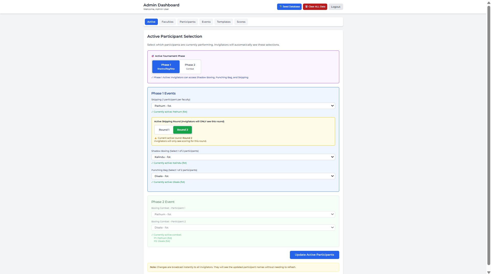
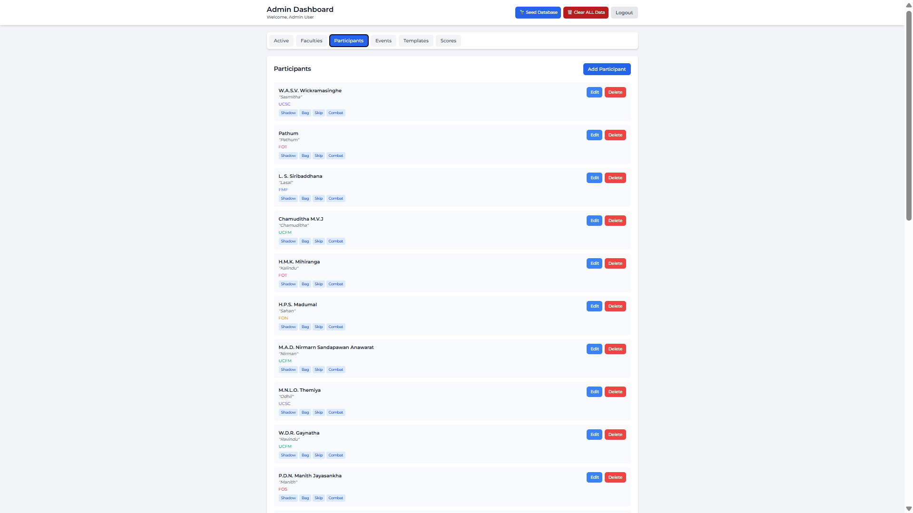
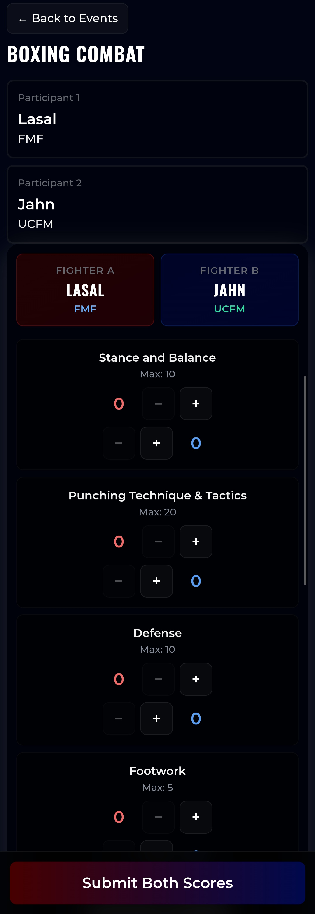
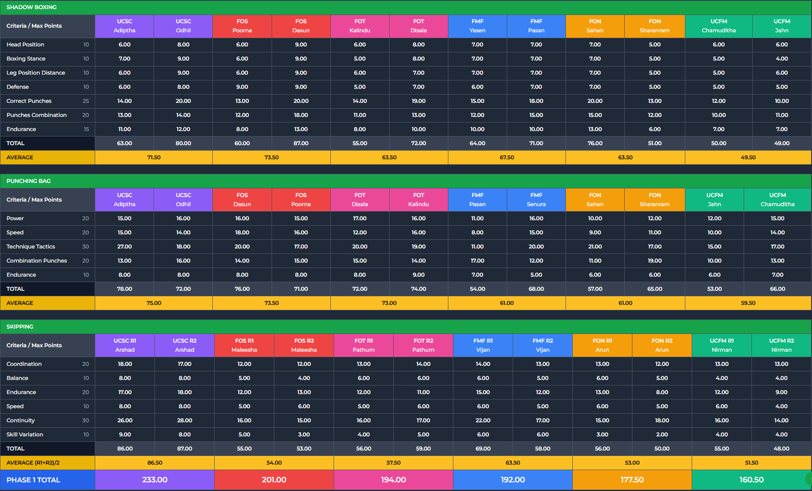
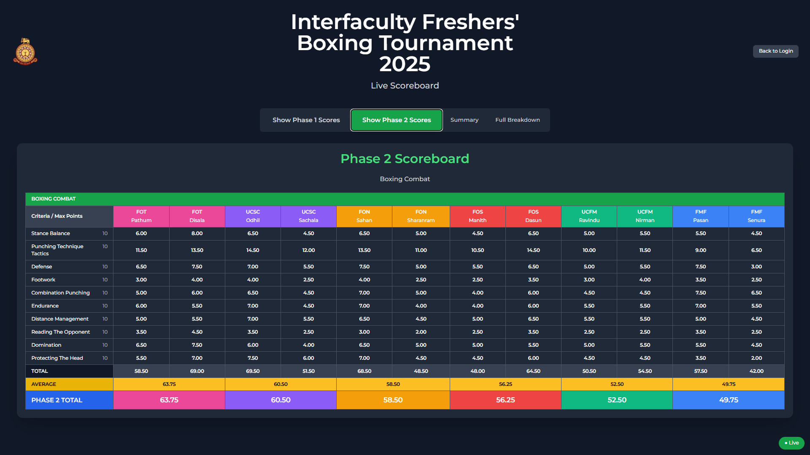
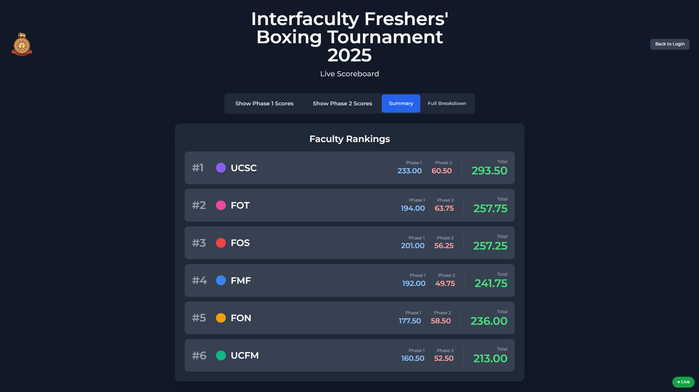
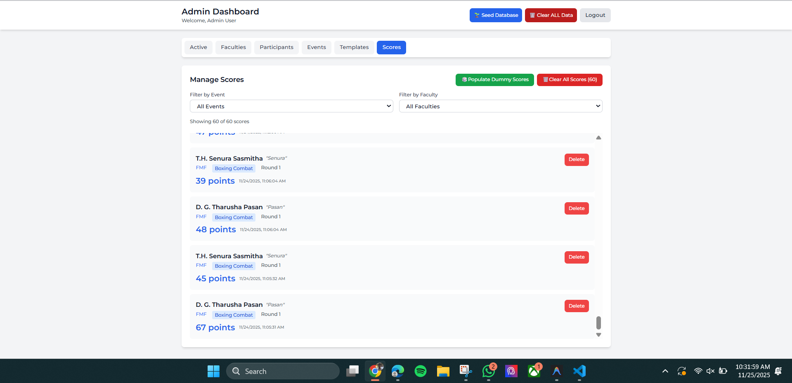
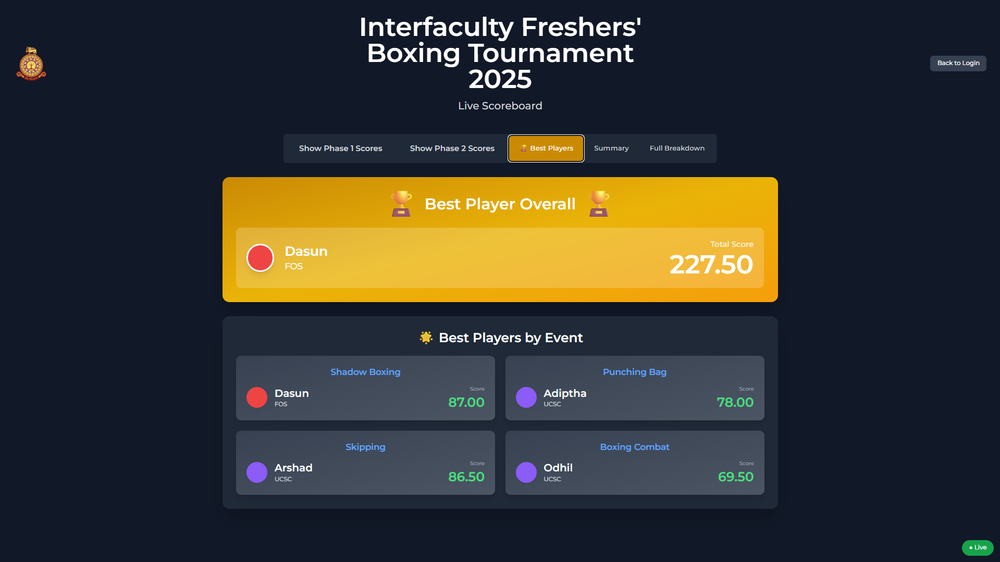

# Boxing Score Card System

A real-time web application for managing and scoring boxing competitions across multiple events. Built with React, TypeScript, and Firebase Firestore, this system provides role-based dashboards for administrators, judges, and display screens with live score synchronization.

## Project Overview

This application was developed to digitize the scoring process for interfaculty boxing competitions. It replaces manual scorekeeping with a centralized system that supports multiple concurrent events, real-time score aggregation, and mobile-optimized judge interfaces. The system handles participant registration, criteria-based scoring, and live display output for audience viewing.

## Screenshots

### Admin Homepage

*Active homepage where administrators can change and manage players*

### Participant List

*Complete participant roster and management*

### Combat Judge Scoring Interface

*Mobile-optimized judge interface for live combat scoring*

### Phase 1 Scorecard

*Phase 1 final scorecard display*

### Phase 2 Scorecard

*Phase 2 final scorecard display*

### Final Scorecard Summary

*Comprehensive final scorecard summary*

### Live Audit System

*Real-time audit system showing live score updates*

### Award Screen

*Award presentation screen*

## Tech Stack

- **Frontend Framework**: React 18 with TypeScript
- **Build Tool**: Vite 5
- **Styling**: Tailwind CSS 3
- **Database**: Firebase Firestore (NoSQL)
- **State Management**: React Context API, Zustand
- **Routing**: React Router 6
- **Deployment**: Firebase Hosting
- **Development Tools**: ESLint, TypeScript Compiler, PostCSS

## Key Features

- Role-based access control with PIN authentication for administrators, judges, and display screens
- Real-time score synchronization across all connected clients using Firestore listeners
- Mobile-optimized judge interface with touch-friendly controls and input validation
- Support for multiple concurrent scoring events with configurable criteria and point systems
- Live display screen with summary and detailed views optimized for projector output
- Client-side score aggregation and faculty ranking calculations
- Criteria-based scoring with maximum point validation per event type

## Project Structure

```
BoxingScoreCard/
├── src/
│   ├── components/          # Reusable UI components
│   │   ├── ScoreInput.tsx         # Score input with validation
│   │   ├── CriteriaList.tsx       # Scoring criteria display
│   │   ├── ParticipantCard.tsx    # Participant information card
│   │   └── TotalsTable.tsx        # Faculty rankings table
│   ├── contexts/
│   │   └── AuthContext.tsx        # PIN authentication state management
│   ├── hooks/
│   │   └── useRealtimeData.ts     # Firestore real-time data listeners
│   ├── lib/
│   │   ├── firebase.ts            # Firebase initialization
│   │   ├── firestoreHelpers.ts    # Database CRUD operations
│   │   ├── seedData.ts            # Database seeding utility
│   │   └── clearData.ts           # Database cleanup utility
│   ├── pages/
│   │   ├── Login.tsx              # PIN-based authentication
│   │   ├── AdminDashboard.tsx     # Administrator interface
│   │   ├── InvigilatorDashboard.tsx  # Judge scoring interface
│   │   └── DisplayScreen.tsx      # Public display view
│   ├── types/
│   │   └── index.ts               # TypeScript type definitions
│   ├── App.tsx                    # Application routing
│   └── main.tsx                   # Application entry point
├── public/                    # Static assets
├── firestore.rules           # Firestore security rules
├── firestore.indexes.json    # Firestore database indexes
├── firebase.json             # Firebase hosting configuration
└── vite.config.ts            # Vite build configuration
```

### Core Modules

- **Admin Dashboard**: Full CRUD operations for faculties, participants, events, scoring templates, and judge assignments
- **Judge Dashboard**: Event-specific scoring interface with criteria-based input and validation
- **Display Screen**: Real-time score presentation with multiple view modes for audience display
- **Authentication System**: PIN-based role assignment without traditional user accounts
- **Real-time Sync**: Firestore onSnapshot listeners for live data propagation across all clients

## How to Run Locally

### Prerequisites

- Node.js 18 or higher
- npm package manager
- Firebase account (free tier supported)
- Modern web browser (Chrome, Firefox, Safari, or Edge)

### Installation Steps

**1. Clone the repository and install dependencies**

```bash
cd BoxingScoreCard
npm install
```

**2. Configure Firebase**

Create a Firebase project:

- Navigate to [Firebase Console](https://console.firebase.google.com/)
- Create a new project or select an existing one
- Enable Firestore Database (start in test mode for development)
- Register a web application and obtain the configuration object

**3. Set environment variables**

Copy the example environment file:

```bash
cp .env.example .env
```

Update `.env` with your Firebase credentials:

```env
VITE_FIREBASE_API_KEY=your_api_key
VITE_FIREBASE_AUTH_DOMAIN=your_project.firebaseapp.com
VITE_FIREBASE_PROJECT_ID=your_project_id
VITE_FIREBASE_STORAGE_BUCKET=your_project.appspot.com
VITE_FIREBASE_MESSAGING_SENDER_ID=your_sender_id
VITE_FIREBASE_APP_ID=your_app_id
```

**4. Deploy Firestore security rules**

```bash
npm install -g firebase-tools
firebase login
firebase init
```

Select Firestore when prompted, then deploy rules:

```bash
firebase deploy --only firestore:rules
```

**5. Seed the database with initial data**

```bash
npm run seed
```

This creates sample data including:

- 4 faculties (UCSC, Management, Technology, Science)
- 4 events (Shadow Boxing, Punching Bag, Skipping, Boxing Combat)
- Scoring templates with criteria for each event
- Sample participants and judge accounts
- Default PIN codes for testing

**6. Start the development server**

```bash
npm run dev
```

Access the application at `http://localhost:5173`

### Default PIN Codes (Development)

- Admin: `123456`
- Display Screen: `999999`
- Shadow Boxing Judge: `111111`
- Punching Bag Judge: `222222`
- Skipping Judge: `333333`
- Combat Judge: `444444`

### Build for Production

```bash
npm run build
```

The production build will be output to the `dist/` directory.

### Deploy to Firebase Hosting

```bash
firebase deploy --only hosting
```

## Database Schema

### Firestore Collections

- **pins**: Authentication mapping (PIN codes to role assignments)
- **faculties**: Faculty information with display properties (name, color, order)
- **participants**: Participant records linked to faculties
- **events**: Competition events with associated scoring templates
- **templates**: Scoring criteria definitions (criteria name, maximum points)
- **invigilators**: Judge assignments to specific events
- **scores**: Individual score submissions with judge, event, and participant references
- **assignments**: Round and participant selection management (optional)

### Scoring Criteria by Event

- **Shadow Boxing**: 7 criteria, 95 maximum points
- **Punching Bag**: 5 criteria, 100 maximum points
- **Skipping**: 6 criteria, 110 maximum points
- **Boxing Combat**: 10 criteria, 100 maximum points

Detailed criteria specifications are available in [docs/SCORING_CRITERIA.md](docs/SCORING_CRITERIA.md).

## Security Model

Firestore security rules enforce the following access controls:

- **Public read access**: Faculties, participants, events, templates, scores (required for display screen)
- **Admin write access**: All collections except scores
- **Judge write access**: Scores collection, restricted to assigned events only
- **PIN authentication**: Read access to pins collection for login validation

Complete security rules are defined in [firestore.rules](firestore.rules). For comprehensive security guidelines, see [docs/SECURITY.md](docs/SECURITY.md).

## Future Improvements

- Score audit logging and version history
- PDF and CSV export functionality for final results
- Cloud Functions for server-side score aggregation and validation
- Multi-round tournament bracket management
- Enhanced analytics and statistical reporting
- Offline mode support with synchronization
- Mobile application using React Native or similar framework

## Deployment

For detailed deployment instructions to Firebase Hosting or other platforms, see [docs/DEPLOY.md](docs/DEPLOY.md).

## Screenshots

_Note: Screenshots will be added in a future update. This application includes three main interfaces: admin dashboard, judge scoring view, and public display screen._

## Common Issues

### Module resolution errors

Ensure all dependencies are installed: `npm install`

### Scores not displaying on the display screen

- Verify Firestore security rules are deployed: `firebase deploy --only firestore:rules`
- Confirm environment variables in `.env` match your Firebase project configuration
- Check browser console for error messages

### PIN authentication fails

- Verify the seed script ran successfully: `npm run seed`
- Confirm the `pins` collection exists in Firestore console
- Ensure PIN values match exactly (case-sensitive numeric strings)

### Poor performance on mobile devices

- Optimize asset sizes, particularly participant images
- Verify stable network connection (Firestore requires internet connectivity)
- Clear browser cache and reload the application

## Technical Implementation Notes

### Design Decisions

**Client-side aggregation**: Faculty totals are calculated in the browser using Firestore real-time listeners. For production deployments with large datasets, consider implementing Cloud Functions for server-side aggregation.

**PIN-based authentication**: The current implementation stores PINs in Firestore for simplicity. For production use, migrate to Firebase Authentication with custom claims for enhanced security.

**Direct score assignment**: The system uses assigned judge scores without averaging. To implement score averaging across multiple judges, modify the `useRealtimeFacultyTotals` hook to group scores by participant and event, then calculate averages.

**No server backend**: All application logic runs client-side with security enforced through Firestore rules. Advanced features such as score adjustment or comprehensive audit logging would benefit from Cloud Functions implementation.

## License

All rights reserved. This software is proprietary and confidential. Unauthorized copying, distribution, or use of this software, via any medium, is strictly prohibited without explicit written permission from the owner.
